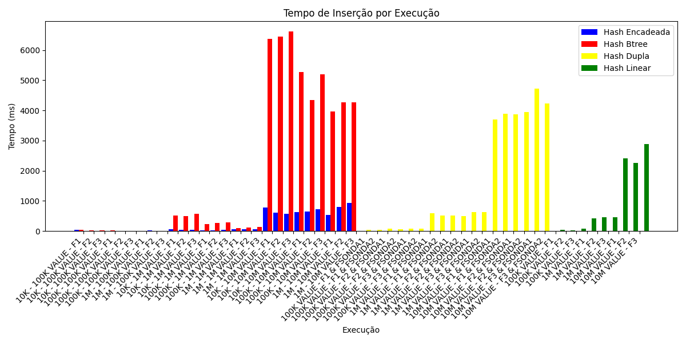
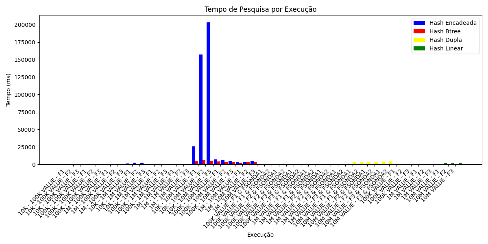
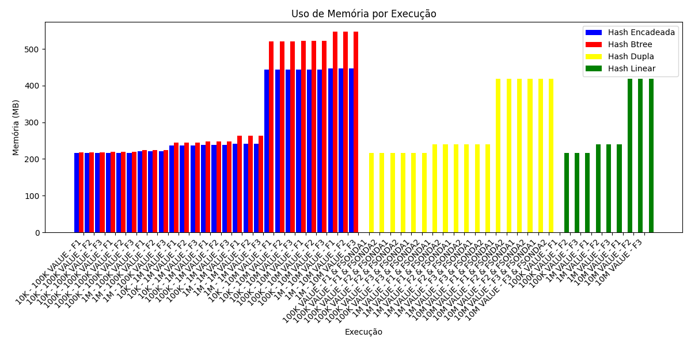
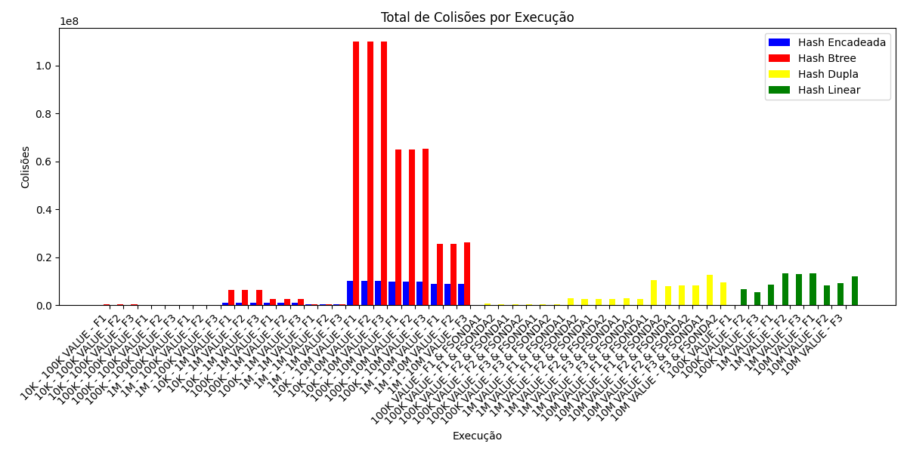

# RA3 Tabelas Hash #️⃣
### Trabalho de "Resolução de Problemas Estruturados em Computação"🎲

## Alunos 👥
- Eduardo Zenere
- Pedro Antonio

## Introdução 📖
- trabalho sobre Hash Tables aonde se deve implementar, utilizar e testar 3 tipos de tabela hash e verificar por meio de análises (por graficos, medição de tempo e outros fatores) o desempenho das 3.
- Este tópico é para trazer informações base para contextualização do projeto e das tables.

- Os tamanhos que utilizamos para os arrays são:
- Para **BTREE e Encadeamento**:
  - 10K = 10.007 posições
  - 100K = 100.103 posições
  - 1M = 1.001.041 posições

- Para **Hash Linear e Dupla**:
  - 100K valores = Tabela de 100_003 posições
  - 1M valores = Tabela de 1_000_003 posições
  - 10M valores = Tabela de  10_000_019 posições

- A quantidade de itens para serem inseridos são exatos:
  - 100K = 100.000 itens
  - 1M = 1.000.000 itens
  - 10M = 10.000.000 itens
 
(Os arrays tem essas quantidades de posições estranhas pois eles precisam ter uma quantidade de posições igual à um número primo, se não as funções de hashing não rodam direito, principalmente as de sondagem no hash duplo)

- **Funções Hashing**⚙
  - Divisão (Resto por divisão)
  - Método de Knuth (Multiplicação)
  - Multiplicação + Divisão
- **Foi feita também 2 Funções Hashing adicionais para a Tabela Hash Dupla devida a sua estrutura/função de sondagem que são:**
  - Subtração com primo fixo
  - Murmurhash3
 
  
- **Sobre a memória**🧠
  - **Memória Base:** A memória que o java ocupa, sem nada rodando ainda.
  - **Memória de Ocupação Fixa:** É a memória base + a quantidade de memória que os valores de teste ocupam.
  - **Memória Utilizada:** A memória de ocupação fixa + a memória utilizada pela arvore hash no momento. Ou seja, pra pegar a memória que a estrutura de tabela hash está ocupando, é preciso fazer **Memória utilizada - Memória de ocupação fixa**

- **Adendo❗**
  - Implementamos também uma Hash Linear no projeto
  - O objetivo e comparar essa estrutura mais simples com as outras 3 estruturas que criamos
  - Em suma, para termos mais análises

     
## As Tabelas

### Tabela Hash Btree🌳
**Descrição:** Nesse tipo de tabela, cada espaço da hash guarda uma árvore binária. Então, se acontecer de vários valores caírem na mesma posição (as famosas colisões), eles são organizados dentro dessa árvore. Isso ajuda a deixar as buscas e inserções mais rápidas do que se fosse só uma lista simples.

**Funções:** 
- **Inserção**: Uma função para inserir novos elementos dentro da tabela, ela primeiramente calcula a posição no array usando a função de hash, se não existir uma árvore naquela posição, cria-se uma nova BTree com o elemento. caso contrário, insere-se o elemento na árvore que estiver naquela posição e atualiza o contador de colisões com a altura do nó inserido (representando a "profundidade da colisão").
- **Busca**: Procura pelo valor da chave, calcula a posição no array usando (uma das) a função Hash, se houver uma árvore naquela posição, realiza-se uma busca dentro da árvore (BTree.search), e enfim, ele retornará o valor correspondente a chave ou NULL se não encontrado
- **Gap:** Faz uma análise da distribuição de elementos na tabela hash, e então calcula-se os gaps (posições vazias existentes) entre cada árvore, e por fim retorna um array com o maior, menor e a média dos gaps
- **Altura:** Faz uma análise da altura das árvores em cada posição da tabela e calcula-se o menor, maior e a média de altura das árvores (permitindo avaliar o balanceamento da tabela e identificar possíveis árvores muito profundas (responsáveis por gerar muitas colisões)

**Estrutura:**
- **ARRAY PRINCIPAL:** Um vetor de tamanho fixo (determinado pela variável 'tamanho'), que serve como uma base para tabela hash. Cada posição do array pode armazenar uma instância de BTree, ou seja, uma árvore binária que armazena os elementos que colidiram naquele índice da tabela.
- **FUNÇÃO HASH:** É uma função fornecida externamente que recebe a chave e o tamanho da tabela e retorna um valor inteiro que indica a posição no array. Essa função define como os elementos são distribuídos entre as árvores da tabela.
- **ÁRVORE BINÁRIA:** Cada elemento do array (tabela(i)) pode ser uma árvore binária que armazena múltiplos elementos com chaves diferentes. Cada BTNode(em outras palvras, folha) armazena uma chave (key) e um valor (Registro), além de referências para os filhos esquerdo e direito. A árvore mantém a ordenação das chaves, permitindo busca, inserção e remoção eficientes dentro de cada posição do array.
- **CONTADOR DE COLISÕES:** Mantém o registro do número de colisões que ocorreram ao inserir elementos na tabela (ou seja, quando múltiplos elementos caem na mesma posição do array e precisam ser inseridos na árvore associada).

----------------------------

### Tabela Hash Encadeada⛓
**Descrição:** Aqui, cada posição da tabela guarda uma lista encadeada. Quando dois valores caem no mesmo lugar, eles são colocados um “atrás do outro” nessa lista. É um jeito bem comum e fácil de lidar com colisões, e funciona muito bem na maioria dos casos.

**Funções:**
- **Inserção:** Calcula-se a posição inicial do Array por meio da função Hash, se a posição estiver vazia, cria-se um Nó (NoHashEncadeado) e o coloca na posição. Caso contrário, incrementa o contador de colisões e adiciona o novo nó no inicio da lista encadeada daquela posição e por fim ajusta-se o ponteiro próximo do novo nó para o nó que estava na posição.
- **Busca:** Também se calcula a posição inicial no array por meio Hash e verifica se há algum nó na posição correspondente, caso exista, percorre a lista encadeada da posição, comparando a chave de cada nó com a chave buscada. Por fim, retorna-se o valor correspondente, ou NULL caso a chave não esteja presente.
- **Gap:** Analisa o intervalo de posições vazias do array principal, e então se calcula o menor, maior e a média dos gaps entre as posições ocupadas
- **maiores_listas:** Percorre todas as listas encadeadas do array e mede seus tamanhos, retorna os três maiores tamanhos de listas encontrados.

**Estrutura:**
- **ARRAY PRINCIPAL:** É um vetor de tamanho fixo que serve como base da tabela hash, cada posição do array pode armazenar o início de uma lista encadeada de nós (NoHashEncadeado).
- **NÓS DA LISTA:** Cada nó armazena
  - Uma chave (chave) que identifica o elemento
  - Um valor (Registro) associado à chave
  - Um ponteiro para o próximo nó da lista (proximo)
  - Permite que múltiplos elementos que colidem na mesma posição do array sejam encadeados.
- **FUNÇÃO DE HASH:** Determina a posição inicial de cada elemento no array, é usada para distribuir os elementos de maneira uniforme nas posições da tabela.
- **CONTADOR DE COLISÕES:** Registra quantas vezes elementos foram inseridos em posições já ocupadas, ou seja, quando é necessário encadear um novo nó na lista existente.
- **LISTAS ENCADEADAS (Como resolução para as colisões):** Quando duas ou mais chaves caem na mesma posição do array, elas são armazenadas em uma lista ligada na mesma posição. Novos elementos são adicionados no início da lista, garantindo inserção rápida.
- **ANÁLISE DE DISTRIBUIÇÃO:** A tabela pode medir os gaps entre posições ocupadas (gap()) e identificar as maiores listas (maiores_listas()), permitindo avaliar a eficiência da distribuição dos elementos.

----------------------------

### Tabela Hash Dupla🎎
**Descrição:** Na hash dupla, a ideia é usar duas funções hash diferentes. Se um valor tenta ocupar uma posição que já está cheia, a segunda função é usada pra achar outro lugar livre. Isso evita que vários elementos se acumulem em sequência e ajuda a espalhar melhor os dados pela tabela.

**Funções:** 
- **Pegar_chave:** Responsável por aplicar essa lógica de dupla hash, combinando o índice inicial da função de hash primária com o deslocamento definido pela função de sondagem multiplicado pelo número de tentativas já realizadas. Assim, a cada colisão o índice é recalculado até encontrar uma posição livre ou confirmar que a chave já está presente.
- **Busca:** Percorre a tabela utilizando a mesma lógica. Ela começa na posição inicial calculada com pegar_chave e verifica se o elemento naquela posição não foi removido e se a chave bate com a desejada. Caso não encontre, incrementa o contador de tentativas e calcula uma nova posição usando a sondagem. Esse processo continua até que a chave seja encontrada ou até que todas as posições possíveis tenham sido verificadas.
- **Inserção:** O método inserir adiciona um novo elemento na tabela seguindo a mesma sequência de cálculos de posição. Se a posição calculada estiver vazia, o elemento é inserido diretamente. Se houver colisão, a função percorre as posições subsequentes usando a sondagem, contabilizando cada colisão, até encontrar um espaço livre ou um slot marcado como removido, que pode ser reutilizado. Caso a chave já exista na tabela, o método atualiza o valor correspondente. Se a tabela estiver cheia, a inserção falha. Após inserir com sucesso, o contador de elementos da tabela é atualizado.
- **Gap:** serve para analisar a distribuição dos elementos no array. Ela percorre o vetor verificando os intervalos de posições vazias entre os elementos existentes. Durante esse percurso, ela identifica o menor e o maior intervalo de espaços vazios consecutivos, além de calcular a média desses gaps.

**Estrutura:**
- **ARRAY PRINCIPAL:** Um vetor de objeto NoHashSimples, onde cada posição armazena um par (chave, valor) representado por um Registro. Se houver duas chaves resultando na mesma posição, o algoritmo usa uma segunda função de hash para encontrar o próximo índice disponível.
- **FUNÇÃO HASH PRIMÁRIA:** A função responsável para calcular-se a posição incial no array. Ela recebe a chave, e o tamanho da tabela, e assim retorna o índice base
- **FUNÇÃO HASH SECUNDÁRIA(SONDA):** Serve para definir o passo de deslocamento quando ocorre uma colisão. Essa segunda função é essencial para garantir que todas as posições possam ser eventualmente alcançadas (evitando ciclos).
- **CONTROLE DE COLISÕES E CONTAGEM DE ELEMENTOS:** Registra a quantidade de colisões ocorridas e indica quantos itens estão ocupando a tabela.

## Análise das Tabelas🔎
- Está junto do código 1 arquivo .ini aonde estão os diferentes resultados que obtivemos com o teste e os tipos de testes solicitados para se fazer no trabalho, como por exemplo.
  - Tempo de Execução (tanto de Inserção quanto para Pesquisa)
  - Número de Colisões
  - 3 Maiores Listas(para cada iteração de Hash Encadeada)
  - Altura (Maior, Menor e Média para Hash Btree)
  - Memória utilizada
  - Gap´s (Maior, Menor e Média)
    
- Como fizemos diversas iterações com as tabelas (para tamanhos e funções hashing diferentes), os resultados também foram diversos, mas foi possível análisar algumas coisas:
  - Cada iteração da Hash Table Encadeada gerou seu trio de maiores listas, mas o **maior** trio dentre as diversas iterações foi:  1138 / 1128 / 1126 (encontrada na iteração HASH ENCADEADA 10K - 10M VALORES - FUNÇÃO 3) 
  - A iteração mais rápida foi para a Hash Encadeada onde uma de suas iterações (HASH ENCADEADA 100K - 100K VALORES - FUNÇÃO 02) teve uma velocidade de **4ms para Inserção** e **7ms para Busca**! ⏳
  - Houve diversas iterações sem Gap´s! (ou seja, o espaço das Hash Tables daquelas iterações foram totalmente bem aproveitadas!) 🕳
  - As iterações com mais colisões foi para as Hash **BTree** onde uma de suas iterações foi **acima de 110 milhões**! 💥

- Também foi feita uma análise em **gráficos** para termos melhor visualização do desempenho das Hash Tables.
  ### 🧩 Tempo de Inserção
  

  ### 🔎 Tempo de Pesquisa
  

  ### 🧠 Uso de Memória
  

  ### 💥 Total de Colisões
  

## Resultado & Conclusão✅
- Feitas as análises gerais, percebe-se que cada Tabela Hash possuí vantagens específicas dependendo do cenário que ela é utilizada.
  - **A Tabela Hash Encadeada ⛓** embora simples e de fácil implementação, apresentou o **maior número de colisões e consumo de memória**, o que reduz seu desempenho em **base de dados mais extensas**
  - **A Tabela Hash BTree 🌳** se mostrou ser a mais estável e eficiente, mantendo tempos consistentes mesmo com o aumento dos dados (devido a sua estrutura de busca balanceada)
  - **A Tabela Hash Dupla 🎎** foi a que mais se destacou devido a seu tempo de busca e inserção serem as melhores das 3 tabelas, além de ter aproveitado a memória de forma eficiente. Ou seja, esta tabela tem mais probabilidade de ser eficiente para aplicações que exigem alto desempenho e controle de fator de carga.

- Em geral, percebe-se com esse projeto que não há uma solução universal, mas sim diferentes estratégias que podemos utilizar para problemas distintos. Cabendo a nós desenvolvedores escolher a melhor técnica para o problema que estamos a lidar, seja esse problema por tamanho ou volume de dados, ou a necessidade de tornar algum processo mais rápido e eficiente, e por aí vai! :]
  
